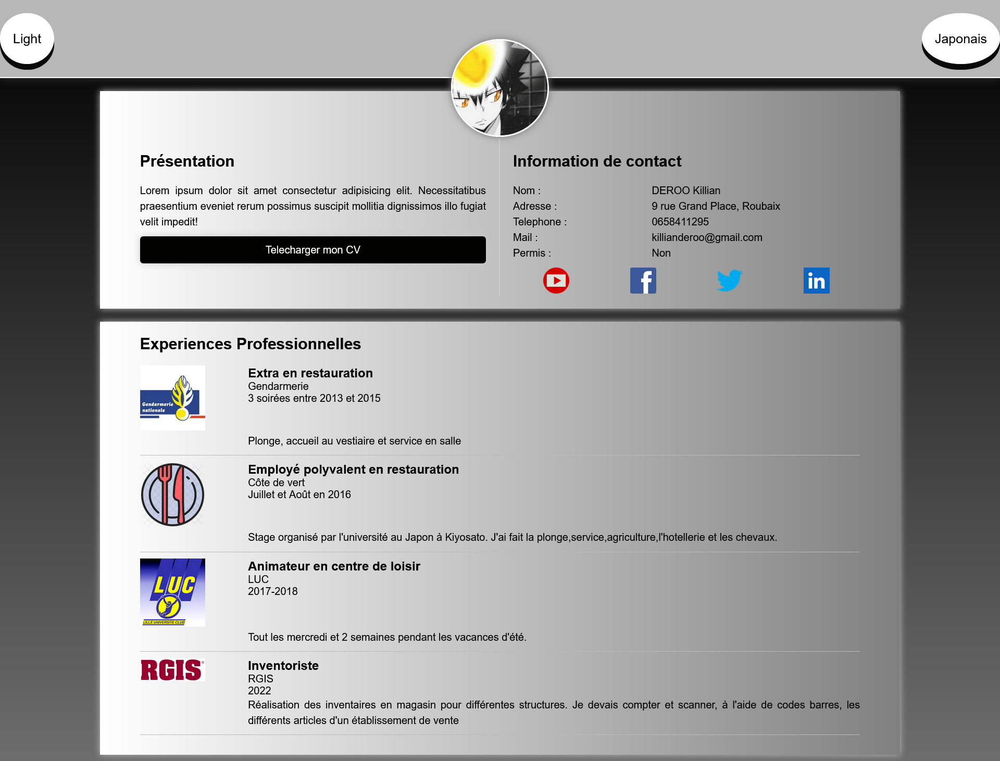
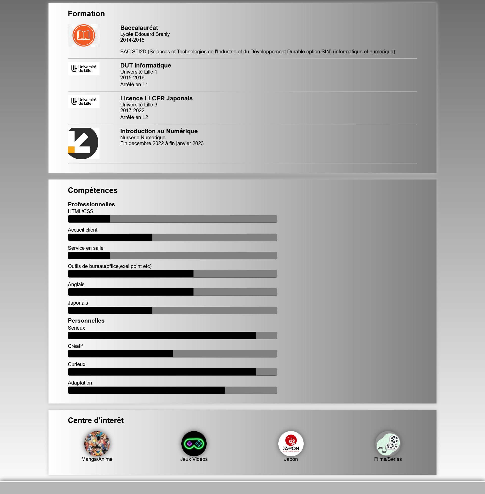
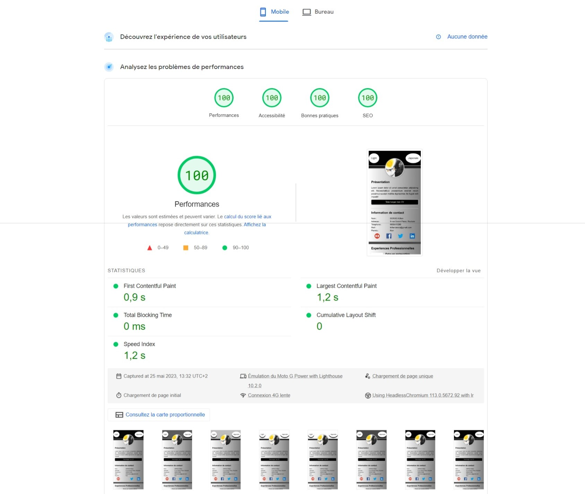
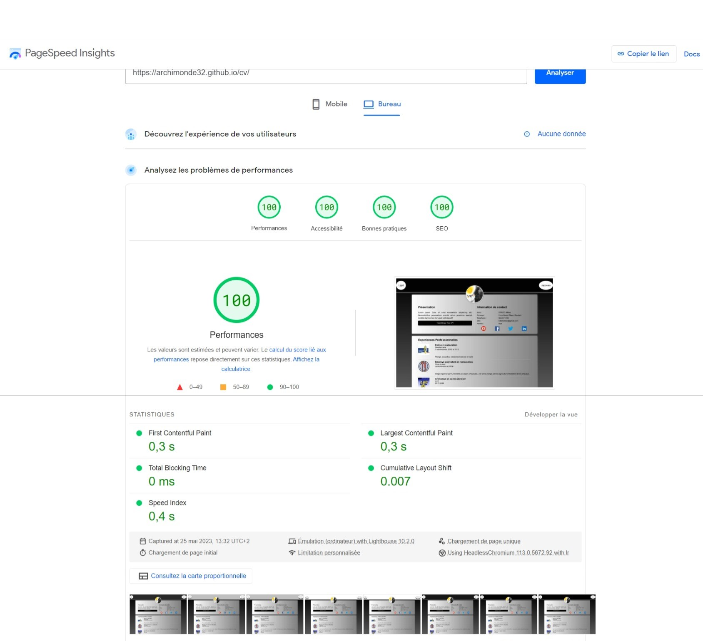

# CV en ligne
Création d'un CV en ligne responsive (mobile,tablette,desktop)

  
  
  

  
## Performance du CV sur PageSpeed Insights
  

    
    
    

    
## Compétences

<ul>
<li>Développer le CV avec HTML5 et CSS3</li>
<li>Mise en place d'un format responsive</li>
<li>Création d'un darkmode avec JavaScript</li>
<li>Analysez les problèmes de performances et d'accessibilité avec PageSpeed Insight et les résoudres</li>
</ul>
    
 ## Ressources
    
<ul>
<li>Visual Studio Code</li>
<li>Github et Github pages</li>
<li>W3C</li>
<li>PageSpeed Insight</li>
</ul>
 
## Languages
    
* [![HTML5][html.com]][html-url]
* [![CSS3][css.com]][css-url]
* [![JS][js.com]][js-url]
    
[html.com]: https://img.shields.io/badge/html5-%23E34F26.svg?style=for-the-badge&logo=html5&logoColor=white
[html-url]: https://html.com/
[css.com]: https://img.shields.io/badge/css3-%231572B6.svg?style=for-the-badge&logo=css3&logoColor=white
[css-url]: https://www.w3.org/Style/CSS/
[react.com]: https://img.shields.io/badge/React-20232A?style=for-the-badge&logo=react&logoColor=61DAFB
[react-url]: https://fr.reactjs.org/
[js.com]: https://img.shields.io/badge/JavaScript-323330?style=for-the-badge&logo=javascript&logoColor=F7DF1E
[js-url]: https://developer.mozilla.org/fr/docs/Web/JavaScript
[sass.com]: https://img.shields.io/badge/SASS-hotpink.svg?style=for-the-badge&logo=SASS&logoColor=white
[sass-url]: https://sass-lang.com/
